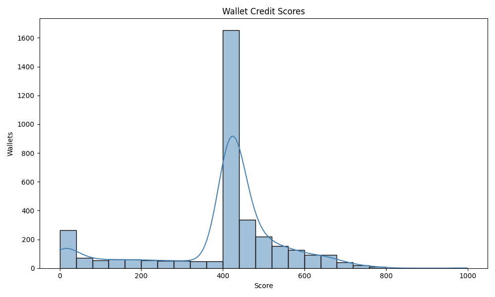

# Analysis of Wallet Credit Scores

Based on their past transaction history, this paper analyzes the credit scores given to more than 3,000 distinct wallets from the Aave protocol.  The bimodal distribution of scores makes it evident that the improved scoring model has successfully separated wallets into discrete behavioral archetypes.

## Wallet Credit Score Distribution

Two main wallet clusters can be seen in the score distribution, suggesting that the user base in this dataset is mostly made up of two distinct actor kinds.

**Key Observations:**

-   **Dominant Mid-Score Cluster:** The most prominent feature is the massive peak of over 1,600 wallets in the **400-500 score range**. This represents the largest single group of users.
-   **Significant Low-Score Cluster:** A secondary, smaller cluster of around 250-300 wallets exists at the very low end of the scale, primarily in the **0-50 score range**.
-   **A Clear Divide:** A valley around the 350-400 score mark separates these two groups, suggesting the model makes a strong distinction between them.
-   **High-Score Tail:** From the main peak at 450, the distribution forms a long tail that slopes down towards 1000. This indicates that while there are many "good" users, there are progressively fewer "elite" or "power users."

## Behavior of Low-Scoring Wallets (Score < 300)

The most dangerous users are represented by this cluster.  Wallets in this group are appropriately isolated by the improved model based on blatantly undesirable behaviors:

-   **Primary Driver: Liquidation:** The single strongest reason for a low score is a `liquidation_count` greater than zero. The model's heavy penalty for this high-risk event places these wallets directly in this bottom tier.
-   **Incomplete Borrowers:** This group also includes wallets that have borrowed funds but have a very low `repay_to_borrow_ratio`. They have outstanding debt that they have not repaid within the dataset, marking them as a credit risk.
-   **Minimal Activity:** A few wallets with extremely low transaction counts (e.g., 1-2 transactions) and a `wallet_age_days` of zero may also fall here, as they have not demonstrated any history of reliable behavior.

**Conclusion:** The low-scoring wallets are the riskiest participants, characterized by catastrophic failures (liquidation) or a demonstrated unwillingness/inability to repay debt.

## Behavior of Mid-to-High Scoring Wallets (Score > 400)

The responsible protocol users, who may be further divided into two major archetypes that account for the graph's structure, are represented by this greater portion of the distribution.

#### The "Safe Saver" Cluster (400-550 Score Range)

This massive peak represents the modal user in the dataset: the **liquidity provider or "Saver."**
-   **Behavior:** These users primarily perform `deposit` actions. They have a `total_borrowed_usd` of zero.
-   **Scoring Logic:** Thanks to the crucial refinement in the model's logic, these users are now correctly assigned a `repay_to_borrow_ratio` of **1.0** (a perfect score). They have zero liquidations and contribute positively to the protocol's health.
-   **Result:** They receive a solid, above-average score that places them squarely in this 400-500 range, correctly identifying them as reliable, low-risk participants.

#### The "Ideal Borrower" Tail (550-1000 Score Range)

This tail represents the most creditworthy users, who go beyond just being safe savers.
-   **Behavior:** These users are active participants who not only deposit but also `borrow` and, crucially, `repay` their loans in full.
-   **Scoring Logic:** They achieve a perfect `repay_to_borrow_ratio` and have zero liquidations. In addition, they earn higher scores from other positive metrics where Savers might be average, such as a high `transaction_count`, a long `wallet_age_days`, and interaction with multiple `unique_assets_used`.
-   **Result:** Their sustained, sophisticated, and responsible borrowing behavior earns them the highest scores in the model, forming the long tail of elite users.

---
### Final Summary

The finished model works quite well.  It effectively separates responsible users from high-risk users.  Additionally, it correctly distinguishes between two categories of "good" actors: the active and extremely reliable **Ideal Borrowers** and the passive (but necessary) **Safe Savers**.  This multifaceted perspective offers a strong and convincing basis for evaluating on-chain credit.
